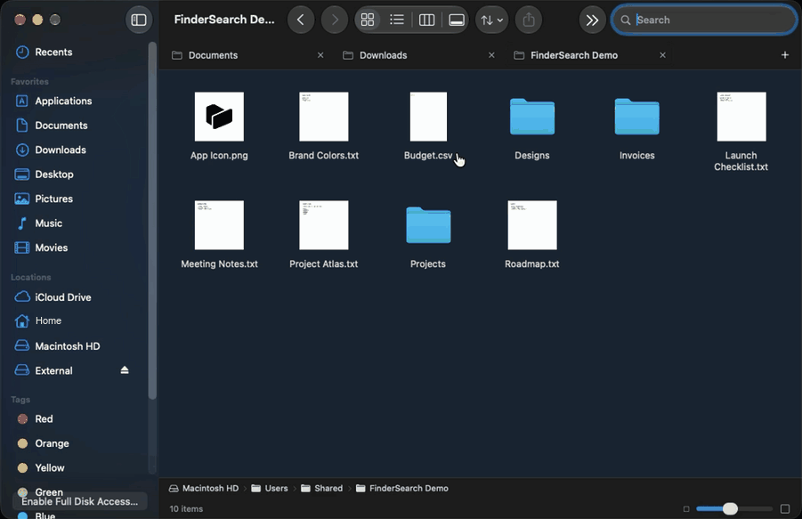

# FinderSearch

A native Mac file browser with fast, fuzzy filename search. Browse folders,
preview files, and manage your files in a familiar macOS interface.

**[Download for Apple Silicon](https://github.com/zeusinsight/FinderSearch/releases/latest)**
· macOS 15+
· [Usage & shortcuts](docs/USAGE.md)
· [Release notes](https://github.com/zeusinsight/FinderSearch/releases)



[Still preview](docs/images/findersearch-icons.jpeg)

## Features

- **Find files quickly.** Fuzzy matching, relevance ranking, folder scope, and
  filters like `ext:pdf` and `mtime:<7d`.
- **Browse your way.** Icon, list, column, and gallery views, Quick Look previews,
  and tabs that restore when you reopen the app.
- **Get file work done.** Drag selection, copy and move, batch rename, ZIP tools,
  tags, sharing, Trash, and undo.
- **Stay in control.** Transfer progress, cancellation, and clear choices when
  files conflict.

Built with SwiftUI and AppKit, powered by
[fsearch](https://github.com/noahdunnagan/fsearch). Search runs locally;
your files aren't uploaded.

## Install

1. Download the DMG and drag **FinderSearch** into **Applications**.
   When updating, quit the old app first and replace it.
2. Eject the disk image and open FinderSearch.
3. Enable **Full Disk Access** in **System Settings → Privacy & Security** to
   search protected folders, then quit and reopen the app.

The app is not yet Developer ID-signed or notarized. If macOS blocks it, choose
**Privacy & Security → Open Anyway**. Allow the first search index to finish building.

[Permissions and troubleshooting →](docs/USAGE.md#permissions-and-indexing)

## Performance

In three warm, exact-filename benchmarks over 10,000 generated files, fsearch
returned results in **0.49–1.14 ms**, versus **7.06–7.30 ms** for Spotlight
(median times on an Apple M4).

These measure the search backend, including its IPC round trip, rather than
rendered UI latency. FinderSearch waits 50 ms after typing stops; Return submits
a pending search immediately.

[Benchmark method, results, and reproduction →](docs/benchmarks/README.md)

## Build from source

Requires **macOS 15+**, **Xcode 16+ or compatible Command Line Tools**, and
**Rust 1.85+ / Cargo**.

```sh
git clone https://github.com/zeusinsight/FinderSearch.git
cd FinderSearch
./scripts/build.sh
open dist/FinderSearch.app
```

The build bundles fsearch automatically. Run tests with `swift test -c release`.
See [CONTRIBUTING.md](CONTRIBUTING.md) for development checks and the code layout.
Apple Silicon is verified; Intel builds remain unverified.

## Current limits

FinderSearch is still early. Content search, AirDrop, Finder extensions, saved
smart folders, folder merging, and persistent undo history aren't supported yet.
Slow disks and cloud providers can still take time.

## License & credits

[MIT](LICENSE). The search engine is [fsearch](https://github.com/noahdunnagan/fsearch)
by [Noah Dunnagan](https://github.com/noahdunnagan), vendored unmodified under its
MIT license. FinderSearch adds the native interface and file workflows.
See [third-party notices](THIRD_PARTY_NOTICES.md).
