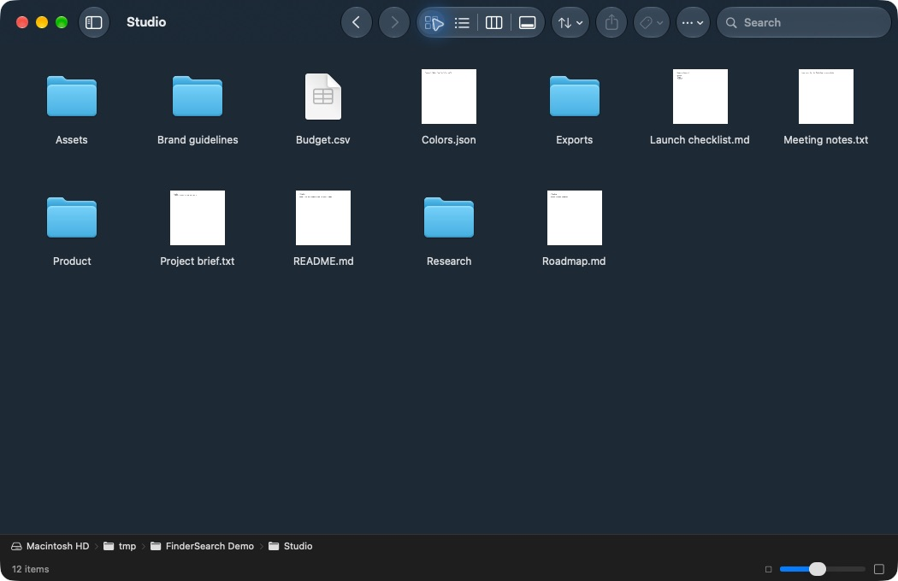
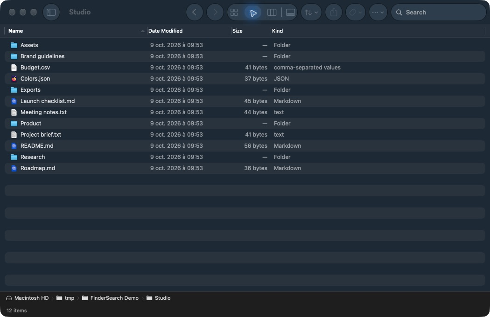

# FinderSearch

A native Mac file browser built around fast filename search.

FinderSearch puts [fsearch](https://github.com/noahdunnagan/fsearch) behind a familiar
macOS interface. Browse folders, preview files, and find what you need without
switching to a terminal.



<details>
<summary>List view</summary>



</details>

## What works

- **Fuzzy filename search.** Typo tolerance, relevance ranking, folder scope, and
  filters such as `ext:pdf` and `mtime:<7d`.
- **Four views.** Icons, a sortable native list, columns, and a gallery with Quick Look.
- **Everyday file work.** Tabs, copy/move, rename, tags, sharing, Trash, and undo.
- **Quick navigation.** Recent folders are cached; clearing search restores your
  browsing view. Uncached folders show loading placeholders.

Built with SwiftUI and AppKit. Search runs locally. Files aren't uploaded.

## Search performance

| Filename query | FinderSearch / fsearch | Spotlight (Finder’s backend) |
| --- | ---: | ---: |
| `atlas-notes-00000.txt` | **0.49 ms** | 7.11 ms |
| `orbit-budget-00001.txt` | **1.14 ms** | 7.06 ms |
| `pixel-design-00002.txt` | **0.86 ms** | 7.30 ms |

Measured on an Apple M4, macOS 27.0, with 10,000 generated files. Medians of 30
warm runs per query; both engines returned the same single match. Spotlight was
queried through native `NSMetadataQuery`, with no per-query process launch.

These are **search backend timings**, not Finder’s rendered UI or FinderSearch’s
end-to-end latency. The app also waits 300 ms after typing stops.
[Method, p95 timings, raw samples, and reproduction](docs/benchmarks/README.md).

## Download

**[Download FinderSearch for Apple Silicon](https://github.com/zeusinsight/FinderSearch/releases/latest)**
(macOS 15 or newer). Open the `.dmg`, drag FinderSearch into Applications, then
eject the disk image and launch the app. No developer tools are required.

This early release is not Developer ID-signed or notarized. If macOS blocks it,
open **System Settings → Privacy & Security → Open Anyway** for FinderSearch.
Grant **Full Disk Access** there to search protected folders, then quit and reopen
the app. Let the first index build before judging search.

## Build from source

You'll need **macOS 15+**, **Xcode 16+ or compatible Command Line Tools**, and
**Rust 1.85+ / Cargo**.

```sh
git clone https://github.com/zeusinsight/FinderSearch.git
cd FinderSearch
./scripts/build.sh
open dist/FinderSearch.app
```

The script bundles fsearch; you don't need to install it separately. Grant
**Full Disk Access** in System Settings → Privacy & Security, then quit and reopen
the app to include protected folders. Let the first index build before judging search.

The app is ad-hoc signed and not notarized. The current build has been checked on
Apple Silicon; Intel and installation on a second Mac remain unverified.

## A few shortcuts

| Action | Shortcut |
| --- | --- |
| Search | ⌘F |
| Change view | ⌘1–4 |
| Quick Look | Space |
| New tab | ⌘T |
| Go to folder | ⇧⌘G |
| Copy / paste / move here | ⌘C / ⌘V / ⌥⌘V |
| Undo | ⌘Z |

[More usage, permissions, and troubleshooting](docs/USAGE.md)

## Still early

This is a file browser, not a replacement for the macOS shell. No AirDrop,
Finder extensions, saved smart folders, batch rename, or persistent session/undo
history yet. Content search isn't exposed in the UI. File conflicts refuse
overwrites; there is no merge dialog. Slow disks and cloud providers can still take time.

## Development

```sh
swift test -c release
```

See [CONTRIBUTING.md](CONTRIBUTING.md) for the code layout and checks.
Bug reports with a reproducible query or navigation sequence are welcome.

## License

FinderSearch is licensed under the [MIT license](LICENSE). You can use, modify,
redistribute, and sell it, including in commercial projects, provided you retain
the copyright and license notice.

## Credit

The search engine is **[fsearch](https://github.com/noahdunnagan/fsearch)** by
**[Noah Dunnagan](https://github.com/noahdunnagan)**. The speed and fuzzy matching
come from his work; this project adds the native browser and file workflows.

The engine is vendored unmodified under its [MIT license](vendor/fsearch/LICENSE).
[Third-party notices](THIRD_PARTY_NOTICES.md).
